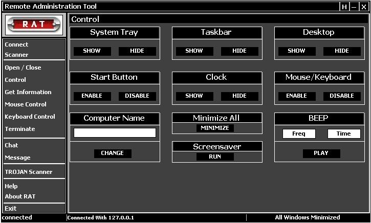



## RAT:Remote Administration Tool

### Description

RAT is an advanced utility developed for network administrators to track and control over the network computers. it had coded in simple and effective way using VB 6.0. it contains server and client program. server will be handeled by admins and client will be running on client machines. it uses basic winsock control. it's special among other tools are

:scanners

:user info

:chat

:message

:trojan scanner
 
### More Info
 
Note: this source is for educational and private purposes only. and iam not responsible for any out breaks.

             |
---                |---
**Submitted On**   |2005-11-21 02:02:16
**By**             |[The Daywalker](https://github.com/Planet-Source-Code/PSCIndex/blob/master/ByAuthor/the-daywalker.md)
**Level**          |Beginner
**User Rating**    |4.9 (34 globes from 7 users)
**Compatibility**  |VB 5\.0, VB 6\.0
**Category**       |[Internet/ HTML](https://github.com/Planet-Source-Code/PSCIndex/blob/master/ByCategory/internet-html__1-34.md)
**World**          |[Visual Basic](https://github.com/Planet-Source-Code/PSCIndex/blob/master/ByWorld/visual-basic.md)
**Archive File**   |[RAT\_Remote19498811202005\.zip](https://github.com/Planet-Source-Code/the-daywalker-rat-remote-administration-tool__1-63319/archive/master.zip)

### API Declarations

it needs "MSWinsock.ocx" to execute if VB not installed

